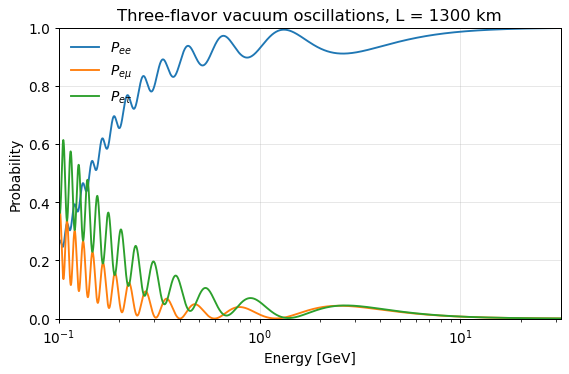
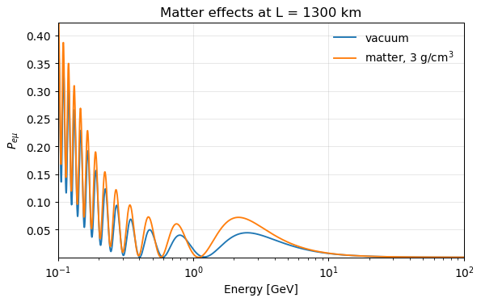
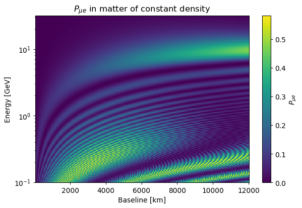
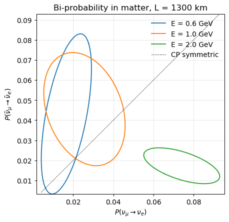
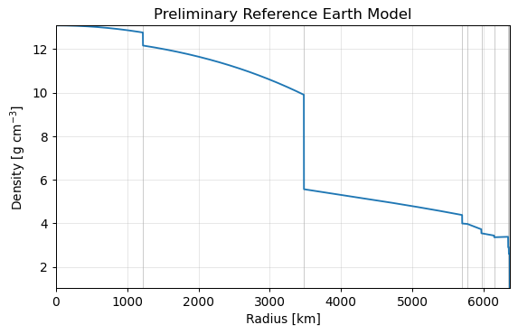
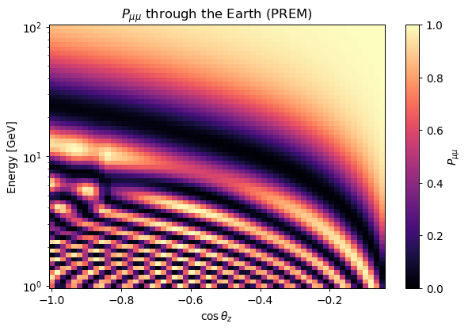
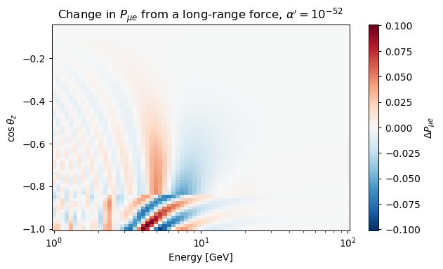
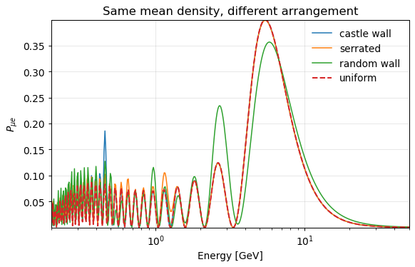
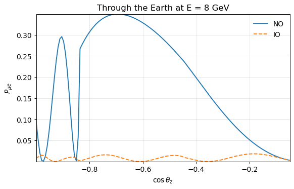

Numerical recipes
=================

What **NuOscProbExact** can compute, with the code that computes it.

Each recipe below is a few lines and a figure.  The figures are the ones the
notebooks produce, so the code shown here and the notebook linked beside it
are the same calculation --- there is no third version to drift out of step.
Where a recipe is short enough to be worth running on the spot, it is executed
when this page is built and its output is what you see.

.. contents::
   :local:
   :depth: 1

One probability
---------------

The shortest useful thing the library does.  Give it a Hermitian matrix and a
baseline in reciprocal units, and it returns the exact probabilities.

.. jupyter-execute::

    import numpy as np

    import globaldefs as gd
    import hamiltonians3nu
    import oscprob3nu

    KM = gd.CONV_KM_TO_INV_EV
    GEV = 1.0e9

    h_vacuum = hamiltonians3nu.hamiltonian_3nu_vacuum_energy_independent(
        gd.S12_NO_BF, gd.S23_NO_BF, gd.S13_NO_BF, gd.DCP_NO_BF,
        gd.D21_NO_BF, gd.D31_NO_BF)

    prob = oscprob3nu.probabilities_3nu(
        np.asarray(h_vacuum)/(1.0*GEV), 1300.0*KM)

    print('P_ee   = %.6f' % prob[0])
    print('P_emu  = %.6f' % prob[1])
    print('P_etau = %.6f' % prob[2])

The nine probabilities come back with the initial flavor varying slowest.
Full walk-through: `notebook 01 <https://github.com/mbustama/NuOscProbExact/blob/main/notebooks/01_basics.ipynb>`_.

A scan, without a loop
----------------------

Pass an array and the whole scan is one call.  This is the single most useful
thing to know about using the library well.

.. jupyter-execute::

    energies = np.logspace(-1.0, 1.5, 500)*GEV
    stack = np.asarray(h_vacuum)/energies[:, None, None]

    probabilities = oscprob3nu.probabilities_3nu(stack, 1300.0*KM)

    print('shape returned:', probabilities.shape)
    print('P_mue at the first three energies:',
          np.round(probabilities[:3, 3], 6))

Note the shape: a batched call returns ``(..., 9)``, with the flavor index
**last**, so ``probabilities[:, 3]`` is :math:`P_{\mu e}` along the scan.  A
scalar call returns a tuple of nine instead.

   Vacuum oscillations at a 1300 km baseline.
   Code: `notebook 02 <https://github.com/mbustama/NuOscProbExact/blob/main/notebooks/02_vacuum_oscillations.ipynb>`_.

Matter, and new physics
-----------------------

Matter, non-standard interactions and Lorentz-invariance violation are not
special cases in the code.  Each is a different Hermitian matrix handed to the
same routine.

.. jupyter-execute::

    h_matter = hamiltonians3nu.hamiltonian_3nu_matter(
        h_vacuum, energies, gd.VCC_EARTH_CRUST)
    h_nsi = hamiltonians3nu.hamiltonian_3nu_nsi(
        h_vacuum, energies, gd.VCC_EARTH_CRUST, gd.EPS_3)

    p_matter = oscprob3nu.probabilities_3nu(h_matter, 1300.0*KM)
    p_nsi = oscprob3nu.probabilities_3nu(h_nsi, 1300.0*KM)

    print('largest difference NSI vs standard matter: %.4f'
          % np.max(np.abs(p_nsi[:, 3] - p_matter[:, 3])))

   The MSW resonance in constant-density matter.
   Code: `notebook 03 <https://github.com/mbustama/NuOscProbExact/blob/main/notebooks/03_matter_nsi_liv.ipynb>`_.

An oscillogram
--------------

A two-dimensional map of energy against baseline, in one call.  Index the two
arguments so they broadcast against each other and the grid falls out.

.. jupyter-execute::

    n_e, n_l = 240, 240
    energies = np.logspace(-1.0, 1.5, n_e)*GEV
    baselines = np.linspace(50.0, 12000.0, n_l)*KM

    h_stack = hamiltonians3nu.hamiltonian_3nu_matter(
        h_vacuum, energies, gd.VCC_EARTH_CRUST)

    # (n_e, 1, 3, 3) against (1, n_l) -> an (n_e, n_l) grid
    grid = oscprob3nu.probabilities_3nu(h_stack[:, None, :, :],
                                        baselines[None, :])[:, :, 3]

    print('grid shape:', grid.shape, '--', grid.size, 'probabilities')
    print('P_mue runs from %.4f to %.4f' % (grid.min(), grid.max()))

   57 600 probabilities, one call, no Python loop.
   Code: `notebook 04 <https://github.com/mbustama/NuOscProbExact/blob/main/notebooks/04_oscillogram.ipynb>`_.

CP violation
------------

Plotting the neutrino appearance probability against the antineutrino one, as
:math:`\delta_{CP}` runs through :math:`2\pi`, traces an ellipse.  Matter
pushes it off the diagonal, which is what makes the measurement hard.

Antineutrinos need **both** changes: conjugate the vacuum Hamiltonian *and*
reverse the sign of the potential.

.. jupyter-execute::

    h_nu = hamiltonians3nu.hamiltonian_3nu_matter(
        h_vacuum, 1.0*GEV, gd.VCC_EARTH_CRUST)
    h_nubar = hamiltonians3nu.hamiltonian_3nu_matter(
        np.conj(h_vacuum), 1.0*GEV, -gd.VCC_EARTH_CRUST)

    print('P(numu -> nue)       = %.6f'
          % oscprob3nu.probabilities_3nu(h_nu, 1300.0*KM)[3])
    print('P(numubar -> nuebar) = %.6f'
          % oscprob3nu.probabilities_3nu(h_nubar, 1300.0*KM)[3])

   Bi-probability ellipses in matter.
   Code: `notebook 05 <https://github.com/mbustama/NuOscProbExact/blob/main/notebooks/05_biprobability.ipynb>`_,
   and `notebook 13 <https://github.com/mbustama/NuOscProbExact/blob/main/notebooks/13_antineutrinos.ipynb>`_
   for antineutrinos in full.

Through the Earth
-----------------

The Earth's density is not constant, so the expansions do not apply to a whole
trajectory.  They apply to any piece of it over which the density is taken
constant, which is what :mod:`earth` builds from the Preliminary Reference
Earth Model :cite:`Dziewonski:1981xy`.

.. jupyter-execute::

    import earth

    print('chord at costhz = -1 : %.0f km'
          % earth.distance_traveled_inside_earth(-1.0))
    print('density at the centre: %.4f g/cm^3' % earth.density_prem(0.0))

    probabilities = earth.probabilities_3nu_earth(
        h_vacuum, 8.0*GEV, -0.8, n_slabs_per_segment=6)
    print('P_mumu at 8 GeV, costhz = -0.8: %.6f' % probabilities[4])

   The Preliminary Reference Earth Model.
   Code: `notebook 06 <https://github.com/mbustama/NuOscProbExact/blob/main/notebooks/06_earth_and_prem.ipynb>`_.

   An Earth oscillogram, in energy and zenith angle.
   Code: `notebook 07 <https://github.com/mbustama/NuOscProbExact/blob/main/notebooks/07_earth_probabilities.ipynb>`_.

An Earth scan, and an Earth oscillogram
---------------------------------------

The energy may be an array, and so may the zenith angle.  Index them on
different axes and they broadcast into a grid, which is an oscillogram in one
call rather than a loop over its points.

.. jupyter-execute::

    import numpy as np

    energies = np.logspace(0.0, 2.0, 200)*GEV
    costhz = np.linspace(-1.0, -0.05, 60)

    scan = earth.probabilities_3nu_earth(h_vacuum, energies, -0.8)
    grid = earth.probabilities_3nu_earth(
        h_vacuum, energies[None, :], costhz[:, None])

    print('scan:', scan.shape, ' grid:', grid.shape)
    print('P_mumu at the first grid point: %.6f' % grid[0, 0, 4])

The geometry, the matter potentials and the slab widths depend on the angle
alone, so a scan builds them once instead of once per energy, and a grid once
per *distinct* angle.  A scalar energy still returns a tuple of nine floats,
exactly as before.

Asking for an accuracy instead of a slab count
----------------------------------------------

``n_slabs_per_segment`` fixes the *discretisation*, not the *error*, and the
two are not the same thing: the error is strongly energy- and
angle-dependent, spanning more than an order of magnitude across a few
decades in energy at the default of eight.  Give ``rtol`` or ``atol`` instead
and the chord is refined until the measured error meets it.

.. jupyter-execute::

    probabilities, n_used = earth.probabilities_3nu_earth(
        h_vacuum, 10.0*GEV, -0.8, atol=1.0e-5, return_n_slabs=True)

    print('sub-slabs needed for atol=1e-5: %d' % n_used)
    print('P_mumu: %.8f' % probabilities[4])

The tolerance binds on **every** returned probability, so no channel is
quietly less converged than was asked for, and a tolerance that cannot be met
raises rather than silently returning a coarser answer.

The search costs about twice one evaluation at the subdivision it settles on,
so for a scan it is worth calling once and reusing the answer, rather than
passing ``atol`` to every point:

.. jupyter-execute::

    n = earth.slabs_for_tolerance(h_vacuum, energies, -0.8, atol=1.0e-4)
    print('one subdivision for the whole scan: %d' % n)
    fast = earth.probabilities_3nu_earth(h_vacuum, energies, -0.8, n)
    print('shape:', fast.shape)

With an array of energies the answer covers all of them, being set by the
worst-converging one.

A profile that is not the Earth
-------------------------------

The same refinement works on any continuously varying Hamiltonian, given as a
callable rather than as PREM: a hand-built density profile, a castle wall, a
solar model.

.. jupyter-execute::

    import slabs

    baseline = 1.0e4*gd.CONV_KM_TO_INV_EV

    def hamiltonian_of(x):
        # A matter potential that varies smoothly along the trajectory
        h = np.broadcast_to(np.asarray(h_vacuum, dtype=complex)/(10.0*GEV),
                            (len(x), 3, 3)).copy()
        h[:, 0, 0] += 1.0e-13*(1.0 + 0.5*np.sin(3.0*np.pi*x/baseline))
        return h

    prob, n = slabs.probabilities_3nu_profile(
        hamiltonian_of, baseline, atol=1.0e-6, return_n_slabs=True)
    print('slabs needed: %d   P_ee = %.8f' % (n, prob[0]))

Where a profile is *discontinuous* — a wall, a shell boundary — equal slabs
are the wrong tool, since no refinement recovers a jump that straddles a
slab.  Split the trajectory at the discontinuities and call once per piece,
which is what :mod:`earth` does with the PREM shells.

A Hamiltonian of your own, through the Earth
--------------------------------------------

:func:`earth.probabilities_3nu_earth` takes the energy-independent *vacuum*
Hamiltonian and builds :math:`H = H_{\rm vac}/E + V_{CC}P_{ee}` per slab
itself, so a Hamiltonian that is not of that form cannot go through it —
non-standard interactions whose strength varies along the path, a
long-range potential sourced by the whole Earth, anything with its own
radial dependence.  Build the slabs, then interpret them yourself:

.. jupyter-execute::

    import slabs

    costhz = -1.0
    widths_km, densities = earth.earth_slabs(costhz, 8)

    # Where each slab sits, which the standard Hamiltonian never needs
    edges = np.concatenate(([0.0], np.cumsum(widths_km)))
    r_km = earth.earth_radial_distance_from_depth(
        costhz, 0.5*(edges[:-1] + edges[1:]))

    h = np.asarray(hamiltonians3nu.hamiltonian_3nu_matter(
        h_vacuum, 10.0*GEV, earth.matter_potential(densities)))

    # Any Hermitian addition of your own goes here.  This one grows
    # toward the centre of the Earth, which no V_CC can imitate.
    extra = 2.0e-14*(1.0 - r_km/gd.EARTH_RADIUS)
    h = h + extra[:, None, None]*np.diag([1.0, -1.0, 0.0])

    print('slabs: %d' % len(widths_km))
    print('P_mue = %.6f'
          % slabs.probabilities_3nu_slabs(h, widths_km*KM)[3])

:func:`earth.earth_slabs` does the part worth reusing — it cuts the chord at
every PREM boundary it crosses, so no slab straddles a discontinuity — and
with the extra term set to zero this reproduces
:func:`earth.probabilities_3nu_earth` exactly, since it is the same
construction.  That equality is the check to run first when building a
Hamiltonian this way.

   A long-range force from a gauged :math:`L_e - L_\mu` symmetry, in energy
   and zenith angle.
   Code: `notebook 20 <https://github.com/mbustama/NuOscProbExact/blob/main/notebooks/20_arbitrary_hamiltonian.ipynb>`_.

Between two places on the Earth
-------------------------------

The chord between two named sites, and the probability along it.
:func:`earth.probabilities_3nu_between_locations` does the lookup, the
geometry and the PREM slabbing in one call.

.. jupyter-execute::

    for source, detector in (('cern', 'gran_sasso'),
                             ('fermilab', 'homestake'),
                             ('tokai', 'kamioka')):
        lat1, lon1 = earth.coordinates_of_named_location(source)
        lat2, lon2 = earth.coordinates_of_named_location(detector)
        chord = earth.chord_length_inside_earth(lat1, lon1, lat2, lon2)
        p_mue = earth.probabilities_3nu_between_locations(
            h_vacuum, 1.0*GEV, source, detector, n_slabs_per_segment=6)[3]
        print('%-22s %8.1f km   P_mue = %.6f'
              % (source + ' to ' + detector, chord, p_mue))

Those are the baselines the experiments quote: CNGS is 730 km, T2K 295 km.
Fermilab to Homestake comes out at 1285 km against DUNE's quoted 1300, the
difference being that DUNE quotes the distance to the detector hall rather
than the surface chord.
Code: `notebook 07 <https://github.com/mbustama/NuOscProbExact/blob/main/notebooks/07_earth_probabilities.ipynb>`_.

An arbitrary matter profile
---------------------------

:mod:`slabs` takes any sequence of widths and Hamiltonians, so a profile can be
built by hand.  Castle-wall profiles are the interesting case: the arrangement
of the matter can change the answer even when the mean density does not.

The effect is *resonant*, not generic --- at most energies the two agree
closely, and near a particular one they do not.

.. jupyter-execute::

    import slabs

    widths_km = np.full(24, 250.0)
    castle = np.where(np.arange(24) % 2 == 0, 2.0, 8.0)
    uniform = np.full(24, castle.mean())

    def appearance(densities, energy):
        h = hamiltonians3nu.hamiltonian_3nu_matter(
            h_vacuum, energy, earth.matter_potential(densities))
        return slabs.probabilities_3nu_slabs(h, widths_km*KM)[3]

    print('mean density, both cases: %.1f g/cm^3' % castle.mean())
    for energy_gev in (0.44, 3.0):
        print('E = %4.2f GeV : castle %.4f   uniform %.4f' %
              (energy_gev,
               appearance(castle, energy_gev*GEV),
               appearance(uniform, energy_gev*GEV)))

At 3 GeV the two are indistinguishable; at 0.44 GeV the castle wall gives
nearly four times the appearance probability of a uniform slab of the same
mean density.

   Four profiles, one mean density.
   Code: `notebook 08 <https://github.com/mbustama/NuOscProbExact/blob/main/notebooks/08_unusual_density_profiles.ipynb>`_.

Mass ordering and the octant
----------------------------

``globaldefs`` carries the NuFit best fit for both orderings, so comparing them
needs no numbers typed in.  Matter is what separates them: the potential enters
with a definite sign, so it enhances the resonance for one ordering and
suppresses it for the other.

.. jupyter-execute::

    def h_vacuum_3nu(ordering='NO', s23=None):
        """Energy-independent vacuum Hamiltonian, for either ordering."""
        if ordering == 'NO':
            pars = (gd.S12_NO_BF, gd.S23_NO_BF, gd.S13_NO_BF,
                    gd.DCP_NO_BF, gd.D21_NO_BF, gd.D31_NO_BF)
        else:
            pars = (gd.S12_IO_BF, gd.S23_IO_BF, gd.S13_IO_BF,
                    gd.DCP_IO_BF, gd.D21_IO_BF, gd.D31_IO_BF)
        s12, s23_bf, s13, dcp, d21, d31 = pars
        return hamiltonians3nu.hamiltonian_3nu_vacuum_energy_independent(
            s12, s23_bf if s23 is None else s23, s13, dcp, d21, d31)

    def p_matter(h, energy):
        """The nine probabilities in crust matter, at 1300 km."""
        return oscprob3nu.probabilities_3nu(
            hamiltonians3nu.hamiltonian_3nu_matter(
                h, energy, gd.VCC_EARTH_CRUST), 1300.0*KM)

    print('normal   : Dm31 = %+.4e eV^2' % gd.D31_NO_BF)
    print('inverted : Dm31 = %+.4e eV^2' % gd.D31_IO_BF)

    for ordering in ('NO', 'IO'):
        print('  %s : P_mue at 2.5 GeV = %.4f'
              % (ordering, p_matter(h_vacuum_3nu(ordering), 2.5*GEV)[3]))

The octant of :math:`\theta_{23}` is the other open question, and it needs the
appearance channel rather than the disappearance one:

.. jupyter-execute::

    for s23_squared in (0.45, 0.55):
        p = p_matter(h_vacuum_3nu('NO', s23=np.sqrt(s23_squared)), 5.0*GEV)
        print('sin^2(theta23) = %.2f : P_mumu = %.4f   P_mue = %.4f'
              % (s23_squared, p[4], p[3]))

Disappearance depends on :math:`\theta_{23}` mainly through
:math:`\sin^2 2\theta_{23}`, which is symmetric about maximal mixing, so the
two values either side of it are nearly indistinguishable there --- the octant
degeneracy.  Appearance carries :math:`\sin^2\theta_{23}` instead and tells
them apart.

   Matter through the Earth separates the two orderings.
   Code: `notebook 12 <https://github.com/mbustama/NuOscProbExact/blob/main/notebooks/12_ordering_and_octant.ipynb>`_.

A sterile neutrino
------------------

Four flavors is the same call with a bigger matrix.  A 3+1 scenario is a
*closed* four-state system, not a leak out of the three-flavor block, which
is what brings it inside an exact method at all.

.. jupyter-execute::

   import numpy as np

   import globaldefs as gd
   import hamiltonians4nu
   import oscprob4nu

   h4 = hamiltonians4nu.hamiltonian_4nu_vacuum_energy_independent(
       gd.S12_NO_BF, gd.S23_NO_BF, gd.S13_NO_BF,
       np.sqrt(0.10), np.sqrt(0.10), 0.0,
       gd.DCP_NO_BF, gd.D21_NO_BF, gd.D31_NO_BF, 1.0)

   prob = oscprob4nu.probabilities_4nu(np.asarray(h4)/1.0e9,
                                       1300.0*gd.CONV_KM_TO_INV_EV)

   print('%d probabilities, initial flavor slowest' % len(prob))
   print('P(nu_mu -> nu_mu) = %.5f' % prob[5])
   print('P(nu_mu -> nu_s)  = %.5f' % prob[7])

In matter the sterile state changes the problem qualitatively.  It feels
neither potential, so the neutral-current term --- which is proportional to
the identity across the three active flavors, and therefore invisible at two
and three flavors --- no longer cancels.  Removing it from all four states
costs only a global phase and leaves :math:`-V_{NC}` on the sterile entry,
and that entry is what places the sterile matter resonance.

.. jupyter-execute::

   h4_matter = hamiltonians4nu.hamiltonian_4nu_matter(
       h4, 1.0e9, gd.VCC_EARTH_CRUST, gd.VNC_EARTH_CRUST)

   print('nu_e entry : %+.4e eV' % h4_matter[0][0].real)
   print('sterile    : %+.4e eV' % h4_matter[3][3].real)

Through the Earth, the same PREM machinery applies:
:func:`earth.probabilities_4nu_earth` cuts the chord at every shell
boundary and builds both potentials per slab.

.. jupyter-execute::

   import earth

   prob = earth.probabilities_4nu_earth(h4, 1.0e10, -0.8)
   print('P(nu_mu -> nu_mu) through the Earth = %.5f' % prob[5])

Full walk-through: `notebook 16
<https://github.com/mbustama/NuOscProbExact/blob/main/notebooks/16_four_neutrinos.ipynb>`_.

Where to go next
----------------

* :doc:`quickstart` --- the shortest path to a first probability.
* :doc:`methodology` --- what the SU(2), SU(3) and SU(4) expansions actually do, and
  the sign conventions that matter once a matter potential is added.
* :doc:`functions` --- the full API reference, generated from the docstrings.
* `Notebook 17
  <https://github.com/mbustama/NuOscProbExact/blob/main/notebooks/17_cross_checks.ipynb>`_
  --- the same probabilities cross-checked against an independent external
  code, and against a published closed form, with the conventions that have
  to be matched first.
* The `notebooks <https://github.com/mbustama/NuOscProbExact/tree/main/notebooks>`_
  --- eighteen of them, carrying their figures inline.
